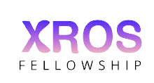
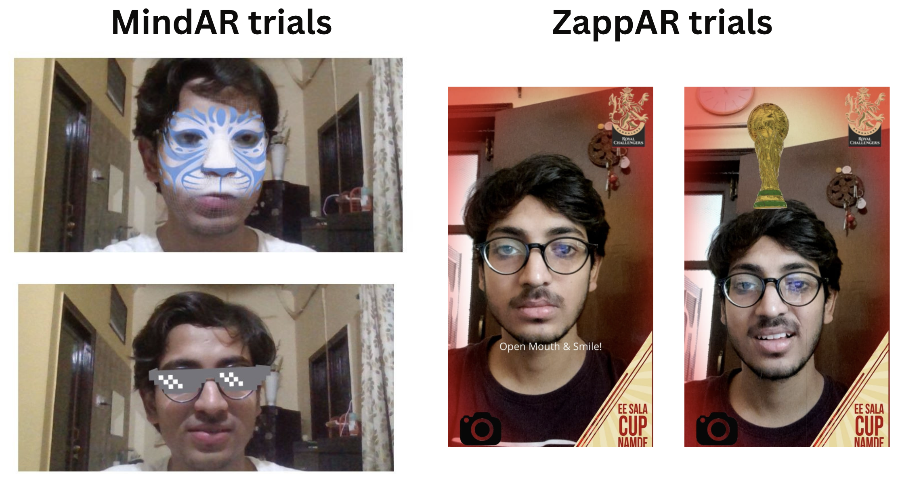
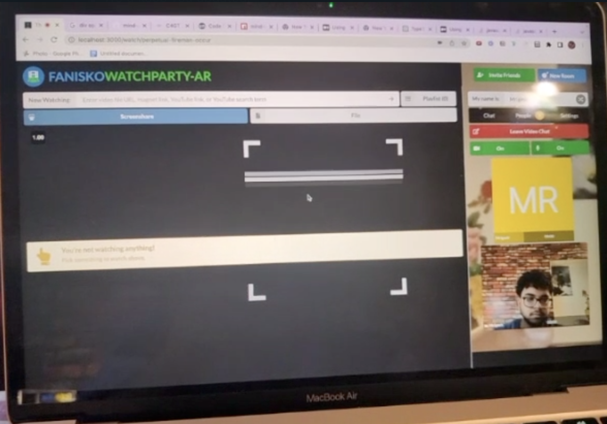
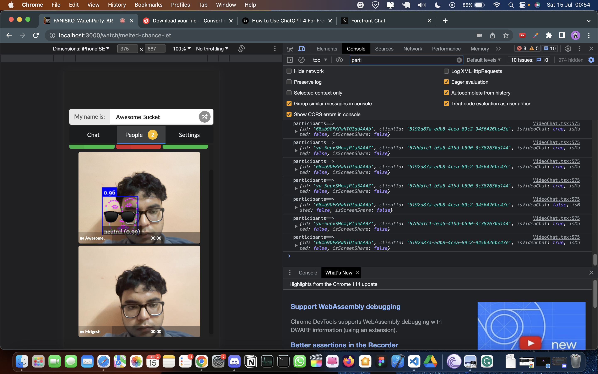
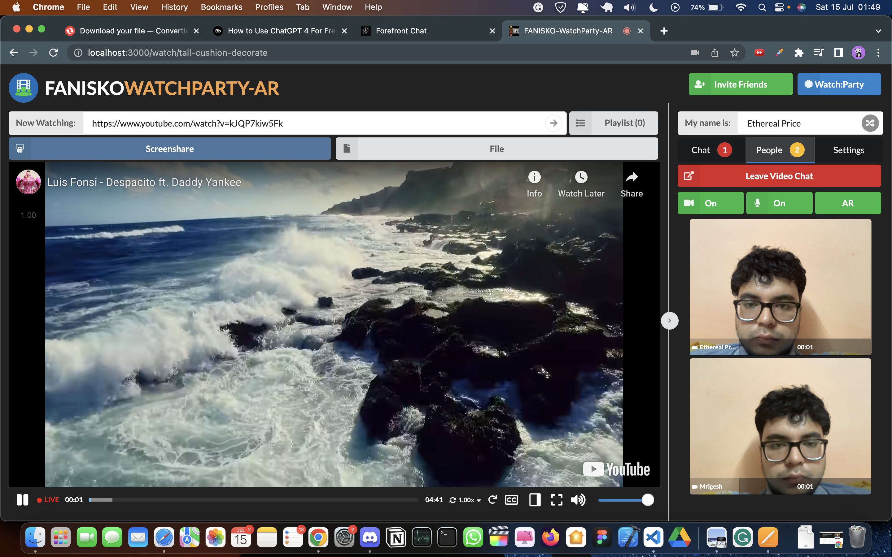
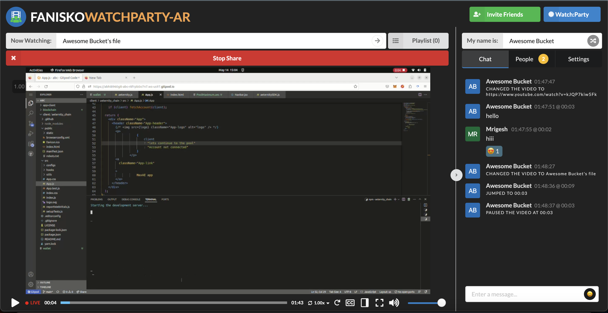
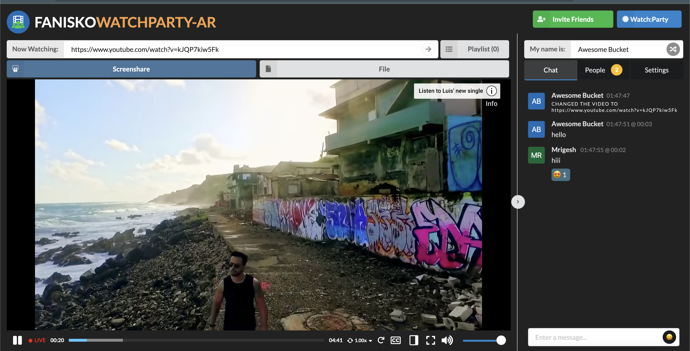

# Fanisko Watchparty AR Project




## Table of Contents

1. [Introduction](#1-introduction)
2. [Project Journey](#2-project-journey)

   - [Inception of the Idea](#inception-of-the-idea)
   - [Research and Planning](#research-and-planning)
   - [Technology Stack Selection](#technology-stack-selection)

3. [Setting Up the Project](#3-setting-up-the-project)
   - [System Requirements](#system-requirements)
   - [Installation Instructions](#installation-instructions)
   - [Configuration Steps](#configuration-steps)
   - [Dependencies and Libraries Used](#dependencies-and-libraries-used)
4. [Creating AR Filters](#4-creating-ar-filters)
   - [Overview of AR Filter Development](#overview-of-ar-filter-development)
   - [Initial Approach: MindAR](#initial-approach-mindar)
     - [Pros and Cons](#pros-and-cons)
     - [Challenges Faced](#challenges-faced)
   - [Transition to Custom AR Solution](#transition-to-custom-ar-solution)
     - [Introduction to Face-api.js and HTML Canvas](#introduction-to-face-apijs-and-html-canvas)
     - [Leveraging Machine Learning with Face-api.js](#leveraging-machine-learning-with-face-apijs)
     - [Applying Filters on Detected Faces](#applying-filters-on-detected-faces)
5. [WebRTC Integration and Streaming](#5-webrtc-integration-and-streaming)
   - [Understanding WebRTC](#understanding-webrtc)
   - [Real-time Communication with WebRTC](#real-time-communication-with-webrtc)
   - [Enabling Streaming Functionality](#enabling-streaming-functionality)
     - [Screen Sharing Feature](#screen-sharing-feature)
     - [YouTube Streaming Integration](#youtube-streaming-integration)
     - [File Sharing Capabilities](#file-sharing-capabilities)
     - [Emoji Chat Implementation](#emoji-chat-implementation)
6. [Key Features and Functionality](#6-key-features-and-functionality)

   - [Enhancing the Live Streaming Experience](#enhancing-the-live-streaming-experience)
   - [User Engagement and Interaction](#user-engagement-and-interaction)

7. [Current Project Stage and Known Issues](#7-current-project-stage-and-known-issues)
   - [Summary of the Current Project Stage](#summary-of-the-current-project-stage)
   - [Evaluation of Project Progress](#evaluation-of-project-progress)
   - [Identified Issues and Limitations](#identified-issues-and-limitations)
   - [Proposed Solutions and Future Improvements](#proposed-solutions-and-future-improvements)
8. [Conclusion](#8-conclusion)

---

## 1. Introduction


Fanisko Watchparty AR - Open Source Project
Fanisko Watchparty AR is an open-source project aimed at creating a meeting platform with augmented reality (AR) features such as face filters and games. It provides users with online meeting options including chat, video call, voice call, file sharing, YouTube video streaming, screen sharing, and more. The project leverages web technologies such as React.js, Three.js, MindAR, Zappar, Face-api.js, A-Frame, VanillaJS, WebRTC, WebSockets, TypeScript, and Babel.

## 2. Project Journey

### Inception of the Idea

This open-source project was developed as a part of the XROS Fellowship under the Fanisko organization. The goal of the project was to create a live streaming watch party platform with augmented reality (AR) features. By incorporating AR technology, the Fanisko Watchparty AR platform aims to provide an immersive and interactive viewing experience for users during live streaming events.

### Research and Planning

The research and planning phase played a crucial role in shaping the direction and implementation of the Fanisko Watchparty AR project. Extensive research was conducted to explore existing AR platforms, streaming technologies, and networking protocols. This section outlines the key milestones and dates during the research and planning phase.

| Milestone               | Date       |
| ----------------------- | ---------- |
| Research kick-off       | 2022-05-01 |
| AR platform analysis    | 2022-05-15 |
| Streaming tech research | 2022-06-01 |
| Networking protocols    | 2022-06-15 |
| Planning and strategy   | 2022-07-01 |

During the research kick-off, the project team gathered to discuss the objectives and scope of the project. The primary focus was on understanding the capabilities and limitations of existing AR platforms and identifying the most suitable options for integrating AR into the watch party platform.

The subsequent milestone involved an in-depth analysis of various AR platforms available in the market. Factors such as ease of integration, performance, and community support were considered during the evaluation process. This research helped the team make an informed decision regarding the selection of the AR engine for the project.

Simultaneously, research was conducted on streaming technologies to identify the best approach for real-time video transmission. Different protocols, including TCP and UDP, were studied, and their suitability for live streaming applications was assessed. This research helped the team gain a deeper understanding of the technical requirements and challenges associated with streaming in the context of the Fanisko Watchparty AR project.

The research also focused on networking protocols, particularly WebRTC, which is widely used for real-time communication in web applications. The team explored the features and functionalities provided by WebRTC and its applicability to enable seamless communication and streaming capabilities within the watch party platform.

Following the research phase, planning and strategy development commenced. The team analyzed the gathered insights, identified project requirements, and formulated a roadmap for the development process. The planning phase involved setting project milestones, allocating resources, and outlining the steps needed to bring the Fanisko Watchparty AR project to fruition.

The research and planning phase provided a solid foundation for the subsequent stages of the project, guiding the technology stack selection, development approach, and implementation strategies. The insights gained during this phase were instrumental in ensuring the successful integration of augmented reality, streaming capabilities, and real-time communication within the Fanisko Watchparty AR platform.

### Technology Stack Selection

| Technology  | Use                                                              |
| ----------- | ---------------------------------------------------------------- |
| ReactJS     | JavaScript library for building user interfaces                  |
| Three.js    | JavaScript 3D library for creating 3D graphics                   |
| MindAR      | Augmented reality engine for creating AR filters                 |
| Zappar      | Augmented reality platform for AR content creation               |
| Face-api.js | JavaScript library for face detection and recognition            |
| A-Frame     | Web framework for building virtual reality experiences           |
| VanillaJS   | Plain JavaScript for additional functionality                    |
| WebRTC      | Real-time communication for streaming and video chat             |
| Websockets  | Protocol for full-duplex communication between client and server |
| TypeScript  | Typed superset of JavaScript for enhanced development            |
| Babel       | JavaScript compiler for backward compatibility                   |

## 3. Setting Up the Project

### System Requirements

To set up the Fanisko Watchparty AR project, ensure that your system meets the following requirements:

- **Operating System:** Windows, macOS, or Linux
- **Processor:** Intel Core i5 or equivalent
- **RAM:** 8GB or higher
- **Graphics Card:** NVIDIA GeForce GTX 1050 or equivalent
- **Storage:** 500GB of available space
- **Browser Compatibility:**
  - Google Chrome (latest version)
  - Mozilla Firefox (latest version)
  - Safari (latest version)
- **Internet Connection:** Stable broadband connection with a minimum speed of 5 Mbps

Please note that these are the recommended system requirements. The project may still work on lower specifications, but performance may be affected.

### Installation Instructions

Follow these steps to run the Fanisko Watchparty AR project locally:

1. **Clone the Repository**

https://github.com/Legend101Zz/Watch-Party-Fanisko

2. **Navigate to the Project Directory**
   cd fanisko-watchparty-ar

3. **Install Dependencies**

npm install

4. **Run the Server**

PORT=8080 npm run dev

5. **Run the Client-side React Code**

- Open a new terminal.
- Navigate to the project directory.
- Run the following command:
  ```
  PORT=3000 npm run react
  ```

6. **Access the Application**

- Open your preferred web browser.
- Visit `http://localhost:3000` to access the Fanisko Watchparty AR application.

Congratulations! You have successfully installed and started the Fanisko Watchparty AR project locally. You can now explore its features and functionalities.

### Configuration Steps

## Configuration

The Fanisko Watchparty AR project utilizes the YouTube API for video search functionality. Follow the steps below to configure the YouTube API:

1. **Get a YouTube API Key**

   - Visit the [Google Developers Console](https://console.developers.google.com/).
   - Create a new project or select an existing project.
   - Enable the YouTube Data API v3 for your project.
   - Generate an API key for the YouTube Data API v3.

2. **Add the API Key to Environment Variables**

   - Copy the `.env.example` file in the project directory and rename it to `.env`.
   - Open the `.env` file and locate the `YOUTUBE_API_KEY` variable.
   - Replace the value of `YOUTUBE_API_KEY` with your YouTube API key.

   Example:
   YOUTUBE_API_KEY=YOUR_YOUTUBE_API_KEY

3. **Restart the Server**

- Restart your server to ensure the changes in the environment variables take effect.

With the YouTube API configured and the API key added to the environment variables, you can now perform video searches via the search box feature in the Fanisko Watchparty AR application.

Please note that without a valid YouTube API key, the video search functionality will not work properly.

Make sure to replace YOUR_YOUTUBE_API_KEY with your actual YouTube API key.

### Dependencies and Libraries Used

## Dependencies and Libraries Used

| Dependency/Library | Purpose                                            |
| ------------------ | -------------------------------------------------- |
| ReactJS            | JavaScript library for building user interfaces    |
| Three.js           | JavaScript 3D library for rendering 3D graphics    |
| MindAR             | AR engine for creating augmented reality filters   |
| Zappar             | AR development platform                            |
| Face-api.js        | Machine learning library for face detection        |
| A-Frame            | Web framework for building virtual reality (VR)    |
| VanillaJS          | JavaScript framework for client-side development   |
| WebRTC             | Real-time communication technology for streaming   |
| Websockets         | Communication protocol for real-time data transfer |
| TypeScript         | Typed superset of JavaScript for improved IDE      |
| Babel              | JavaScript compiler for compatibility              |

## 4. Creating AR Filters

### Overview of AR Filter Development

Augmented Reality (AR) filters play a vital role in enhancing the visual experience of a live streaming watch party. These filters allow users to overlay virtual elements, such as 3D objects, effects, or masks, onto their video feeds in real-time. By adding AR filters, we aim to create an immersive and interactive environment for participants, making the watch party more engaging and enjoyable.

### Initial Approach: MindAR



Initially, we adopted MindAR as our chosen AR engine for developing and applying filters. MindAR provided a comprehensive set of tools and features for face detection and AR filter integration. This decision was based on its reputation for accurate face tracking and robust filter rendering capabilities. We integrated MindAR into our project and began experimenting with various AR filters.

While MindAR offered valuable functionality, we encountered certain limitations that hindered our flexibility and control over the AR filters. We recognized the need for a custom AR solution that could provide us with more freedom to tailor the filters to our specific requirements.

MindAR integration trial with watchparty

### Transition to Custom AR Solution

We started our project by using mind-ar as our primary source of AR output ( the main ar-engine to detect faces and then add a 3d filter on it ) , but then as we tried various approaches and tried many things , we were never able to stream the AR filter across multiple channels (or peers) and here was where our journey into understanding networking protocols began and we took a deep dive into TCP, UDP protocols , how websocktes work and ultimately what is webRTC ?

## 5. WebRTC Integration and Streaming

### Understanding WebRTC

WebRTC (Web Real-Time Communications) is a set of web APIs that enable real-time communication between web browsers without the need for external plugins or additional software. It allows for streaming, file sharing, video/audio sharing, and more between two clients directly within the browser. WebRTC utilizes two main protocols:

- TCP (Transmission Control Protocol): TCP is used for reliable data transmission, such as chatting via web sockets. It ensures that data packets reach the desired destination correctly. TCP requires a server for communication.
- UDP (User Datagram Protocol): UDP is used for tasks like streaming and video/audio sharing. Unlike TCP, it does not guarantee reliable delivery of data packets. However, it does not require a server for communication.

### Real-time Communication with WebRTC

WebRTC architecture enables direct connections between two browsers using UDP. It initializes the connection by using the IP addresses of the clients. TURN/ICE servers help in finding the public IP addresses, facilitating the connection between clients. Signaling is used to share session descriptions (SDP) between clients, establishing a direct connection over UDP without risking privacy.

### Enabling Streaming Functionality

To enable streaming functionality in our project, we leveraged the power of WebRTC for real-time communication and created a custom AR engine using Face-api.js and HTML Canvas. Here's how we implemented it:

1. **Establishing WebRTC Connection:**

   - WebRTC facilitates direct peer-to-peer communication between browsers, enabling seamless streaming.
   - We utilized the WebRTC API to establish a connection between the streaming client and the server.
   - The connection process involved signaling and negotiation to exchange session descriptions and ICE candidates.

2. **Video Streaming:**

   - We utilized the getUserMedia API to capture the user's video stream from their device's camera.
   - The captured video stream was transmitted to the server via the WebRTC connection.
   - On the server-side, the received video stream was processed and distributed to other connected peers for real-time viewing.

3. **Custom AR Engine:**
   - While exploring AR engines like MindAR, we encountered limitations in streaming AR filters across multiple channels.
   - To overcome this, we developed our own AR engine using Face-api.js and HTML Canvas.
   - Face-api.js is an ML library used for face detection and facial landmark detection.
   - By leveraging Face-api.js, we could detect the coordinates of the user's face in real-time.
   - Using the detected face coordinates, we applied HTML Canvas to overlay AR elements on the user's video feed, creating immersive AR effects.

With the combination of WebRTC for streaming and our custom AR engine, we achieved a seamless and interactive streaming experience with real-time AR filters. The user's video stream was transmitted, processed, and augmented with virtual elements, providing an enhanced viewing experience.




## 6. Key Features and Functionality

#### Enhancing the Live Streaming Experience

#### User Engagement and Interaction

## 7. Current Project Stage and Known Issues

### Summary of the Current Project Stage

Overall, the project is in an advanced stage, with the core functionalities implemented successfully. However, there are still areas for improvement and fine-tuning to provide a seamless and immersive AR-powered watch party experience.

### Evaluation of Project Progress

#### AR Filter Development

The development of AR filters has been successfully implemented. We transitioned from using MindAR as the initial AR engine to creating our own custom AR solution using Face-api.js and HTML Canvas. This transition provided more flexibility and control over the AR filters, allowing us to overlay virtual elements on the user's video feed in real-time.


#### WebRTC Integration

WebRTC has been successfully integrated into the project for streaming functionality. Users can now stream their video feeds in real-time and engage with AR filters seamlessly. The WebRTC connection establishment, video streaming, and real-time communication have been implemented and tested.

#### Key Features Implementation

The essential features of the Fanisko Watchparty AR platform have been implemented. These features include:

- Screen sharing: Users can share their screens with other participants, enabling collaborative viewing and interaction.
- YouTube streaming integration: The platform allows users to stream YouTube videos directly within the watch party, enhancing the entertainment experience.
  
- File sharing capabilities: Users can share files, documents, and media files with each other during the watch party, facilitating collaboration and interaction.
  
- Emoji chat: A chat feature with emoji support has been implemented to encourage real-time communication and engagement among participants.



These features enhance the live streaming experience, promote user engagement, and provide a unique and interactive viewing environment.

### Identified Issues and Limitations

#### Issue: Dereferencing Multiple Tracks

One of the main issues faced in the Fanisko Watchparty AR project was the dereferencing of multiple tracks while streaming AR content across multiple peers. The issue arose due to the misconception that AR filters are part of the video itself. In reality, AR filters are created using technologies such as Three.js and MindAR, and they need to be added as overlays to the video element.

To resolve this issue, the project utilized face-api.js, which is an ML face detection model based on TensorFlow.js. The project detects faces using face-api.js and applies the AR filters by drawing them on the HTML canvas element.


### Proposed Solutions and Future Improvements

To address the identified issues and limitations, proposed solutions and future improvements have been outlined. These include optimizing AR filter performance, improving compatibility across different platforms, and enhancing the stability and scalability of the streaming functionality. Additionally, continuous testing, user feedback, and iterative development will be key to refining the project further.

## 8. Conclusion

### Creators

The Fanisko Watchparty AR project was created by:

- Mrigesh Thakur
- Mohammad Asim Khan

### Project Mentor

- Bharathi Kannan

### Organization

Fanisko

For more information, visit the [XROS Fellowship website](https://xrosfellowship.org/).

### License

This project is open-source and is licensed under the [MIT License](LICENSE).
